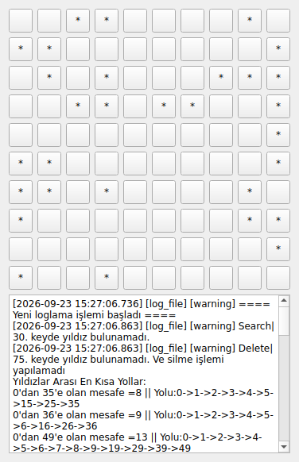

# Qt Hash & Dijkstra


Hash tablosunda çakışma çözümü (linear probing) ve Dijkstra en kısa yol algoritmasının, çoklu thread kullanan bir Qt/C++ masaüstü uygulamasında görselleştirilmesi.

Staj sürecinde (Ağustos–Eylül 2024) hash yapıları ve graf algoritmalarını öğrenmek amacıyla geliştirilmiştir.



## Ne yapıyor?

1. **Izgara:** 10×10'luk bir buton ızgarası oluşturulur. Her hücrenin anahtarı `satır × 10 + sütun` olarak hesaplanır ve hücreler bir hash tablosunda (`QHash`) tutulur.
2. **Yıldız yerleştirme (hash + linear probing):** 3 arka plan thread'i aynı anda çalışarak toplam 30 yıldız yerleştirir. Her thread rastgele bir sayı üretir ve `sayı % hücreSayısı` ile bir anahtara dönüştürür. O hücre doluysa (çakışma) bir sonraki hücreye bakılır, boş hücre bulunana kadar bu tekrarlanır. Bu yöntem hash tablolarında **doğrusal yoklama (linear probing)** olarak bilinir.
3. **Arama ve silme:** Belirli bir anahtarda yıldız olup olmadığı aranır ve bir yıldız silinir.
4. **Dijkstra:** Sol üst köşedeki hücreden (0) her yıldıza en kısa yol hesaplanır ve alttaki panelde yoluyla birlikte gösterilir. Hücreler arasında sadece yatay ve dikey hareket edilebilir.
5. **Loglama:** Bütün işlemler spdlog ile `logs/` klasörüne yazılır. Dosya belirli bir boyuta ulaşınca yeni dosyaya geçilir (rotating log), hatalar ayrı bir dosyada tutulur. Çalıştırma sırasında oluşan uyarılar uygulama içindeki panelde de gösterilir.

## Teknik detaylar

### Thread güvenliği
- Yıldız ekleyen thread'ler arayüze (butonlara) doğrudan dokunmaz. Qt'de arayüz nesnelerine sadece ana thread erişebilir.
- Hangi hücrede yıldız olduğu ayrı bir `QHash<int, bool>` tablosunda tutulur ve bu tablo `QMutex` ile korunur. Boş hücre arama ve işaretleme kilit altında tek adımda yapıldığı için iki thread aynı hücreye yıldız koyamaz.
- Thread yıldızı yerleştirdiğinde `starPlaced` sinyalini gönderir. Qt bu sinyali ana thread'in olay kuyruğuna koyar ve butonu ana thread günceller.
- Arama, silme ve Dijkstra ancak **bütün** thread'ler bittikten sonra başlar.

### Dijkstra
- Öncelik kuyruğu olarak `std::priority_queue` (min-heap) kullanılır.
- Her hücrenin komşuları satır/sütun sınırları kontrol edilerek bulunur. Böylece satırın son hücresinden "sağa" gidildiğinde bir alt satıra atlanmaz.
- Bütün kenar ağırlıkları 1 olduğu için bu ızgarada Dijkstra, BFS (genişlik öncelikli arama) ile aynı sonucu verir. Algoritma ağırlıklı kenarlarda da çalışacak şekilde yazılmıştır.

## Proje yapısı

```
├── main.cpp          # Uygulama giriş noktası
├── GridWindow.h/.cpp # Izgara, arama/silme, Dijkstra, log paneli
├── StarAdder.h/.cpp  # Yıldız yerleştiren thread (hash + linear probing)
├── CMakeLists.txt    # Derleme ayarları (spdlog otomatik indirilir)
└── .github/workflows # Her push'ta derleme + ekran görüntüsü
```

## Derleme

**Gereksinimler:** Qt 6, CMake 3.16+, C++17 destekleyen bir derleyici. spdlog ayrıca kurulmaz, derleme sırasında otomatik indirilir.

```bash
cmake -B build -DCMAKE_BUILD_TYPE=Release -DCMAKE_PREFIX_PATH=<Qt kurulum yolu>
cmake --build build
./build/qt-hash-dijkstra
```

Qt Creator kullanıyorsanız `CMakeLists.txt` dosyasını doğrudan açabilirsiniz.

Her push'ta GitHub Actions projeyi Linux üzerinde Qt 6.7 ile derler, uygulamayı sanal bir ekranda çalıştırıp ekran görüntüsü alır.

## Geliştirme geçmişi

Projenin staj sırasındaki son hali ilk commit'te olduğu gibi duruyor. GitHub'a yüklenirken şu iyileştirmeler yapıldı:

- qmake'ten CMake'e geçildi, GitHub Actions ile otomatik derleme eklendi
- Tek dosyadaki kod sınıflara göre ayrı dosyalara bölündü
- Thread'lerin arayüze doğrudan erişmesi kaldırıldı, paylaşılan veri mutex ile korundu
- Dijkstra'da ızgara kenarından bir alt satıra geçilmesine yol açan komşuluk hatası düzeltildi
- Log panelinin bir önceki çalıştırmanın loglarını göstermesi düzeltildi
- En kısa yol çıktısındaki biçim hatası düzeltildi
